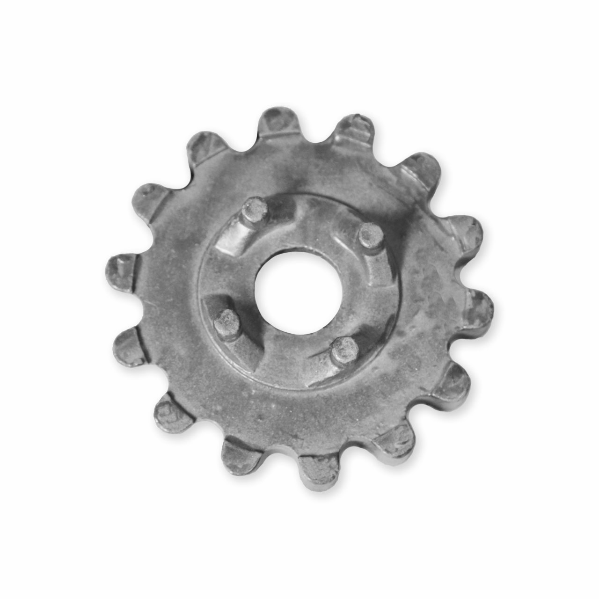
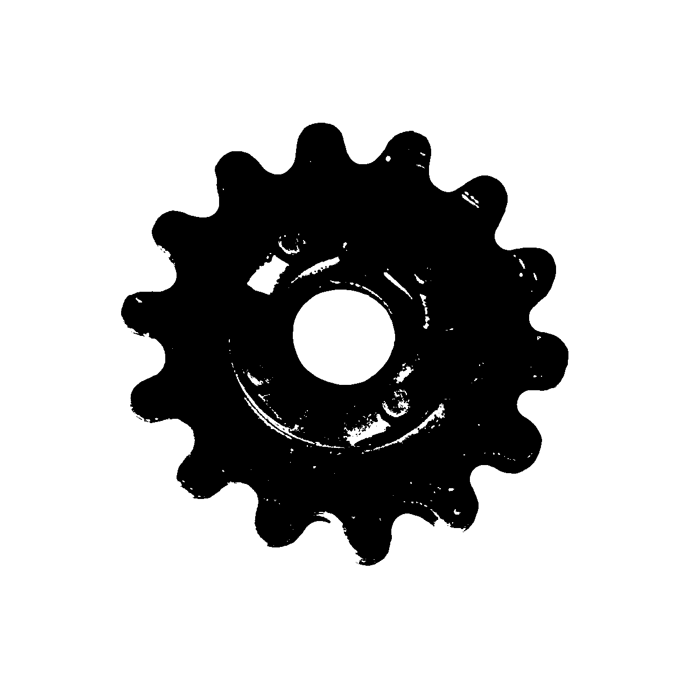
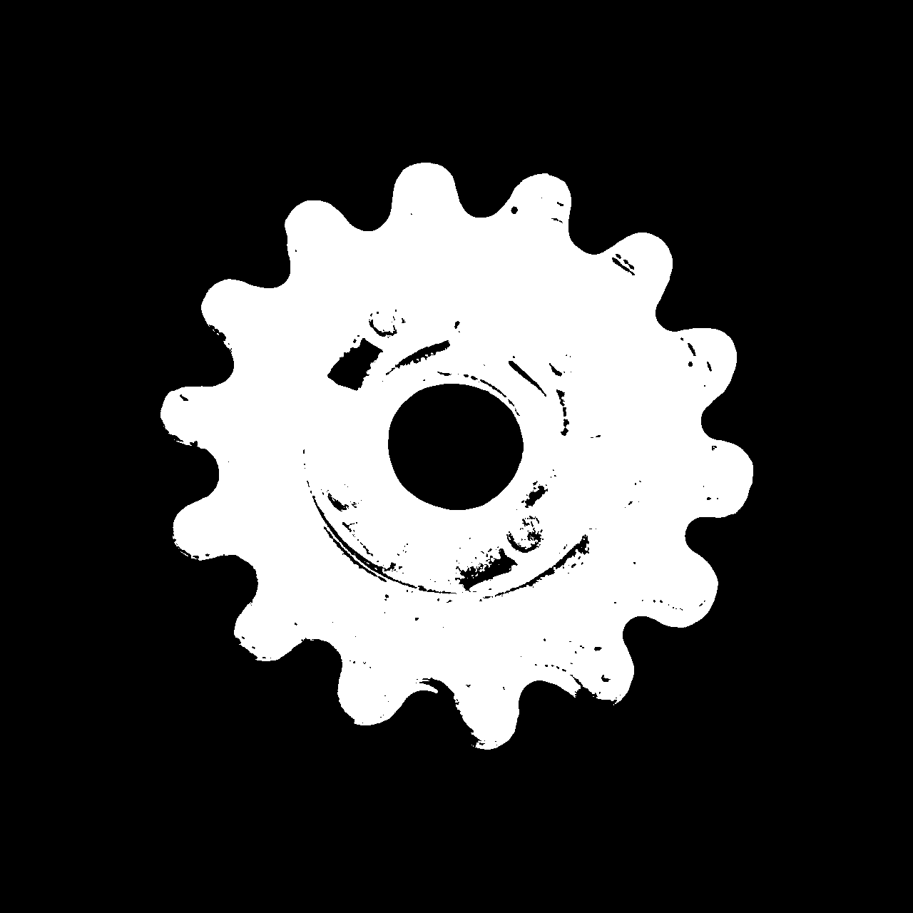
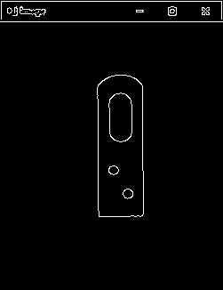

# 实验一 边缘提取与滤波实验报告

## 一、实验目的

掌握图像边缘提取、边缘检测与图像滤波的基本原理；使用 Python 和 OpenCV 实现阈值分割、反色、轮廓提取、均值滤波、中值滤波、高斯滤波、Sobel 边缘检测和 Robert 边缘检测。

## 二、实验设备及仪器

计算机；Python；OpenCV；NumPy。

## 三、图像处理思路总结

本实验的处理主线是“灰度化降低数据复杂度，阈值分割突出目标，反色统一目标与背景关系，再用轮廓或边缘算子提取边界”。滤波部分通过均值、中值、高斯三种方法对图像进行平滑处理，比较不同滤波器对噪声抑制和边缘保留的影响。边缘检测部分分别使用 Sobel 和 Robert 算子观察梯度模板大小、方向响应和噪声敏感性的差异。

## 四、实验方法与步骤

1. 读取 `齿轮.bmp`，灰度化后设置阈值 180 得到二值图，再反色并提取轮廓。
2. 读取 `20210416144049781.png`，分别调用 `cv2.blur`、`cv2.medianBlur`、`cv2.GaussianBlur` 完成均值、中值、高斯滤波。
3. 读取 `齿轮.bmp`，灰度化并反色，分别使用 Sobel 方法和 Robert 方法检测边缘。

## 五、实验结果

灰度图：

阈值分割图：

反色图：

轮廓提取结果：

均值滤波结果：

中值滤波结果：

高斯滤波结果：

高斯滤波后 Canny 边缘：

Sobel 边缘检测：

Robert 边缘检测：

主要参数和结果：

- `齿轮.bmp` 图像尺寸为 1280 x 1280 x 3。
- 阈值分割参数为 180。
- 轮廓提取数量为 11。
- 均值滤波核为 5 x 5，中值滤波核为 5，高斯滤波核为 5 x 5。
- 高斯滤波后 Canny 阈值为 80 和 160。

## 六、结果分析

阈值分割能够把目标和背景初步分开，反色后目标区域更适合轮廓提取。均值滤波对整体噪声有平滑作用，但会削弱边缘；中值滤波对椒盐类噪声更有效，边缘保持相对较好；高斯滤波平滑更自然，适合在 Canny 边缘检测前降低噪声。Sobel 算子对水平和垂直方向灰度变化敏感，边缘较连续；Robert 算子模板较小，对细节响应明显，但更容易受噪声影响。

## 七、思考与练习

提升输出图像质量可以从三方面入手：选择更合适的阈值或自适应阈值；在边缘检测前进行适度滤波；根据目标尺寸调整滤波核、Sobel 核和 Canny 阈值，减少噪声边缘并保留真实轮廓。

