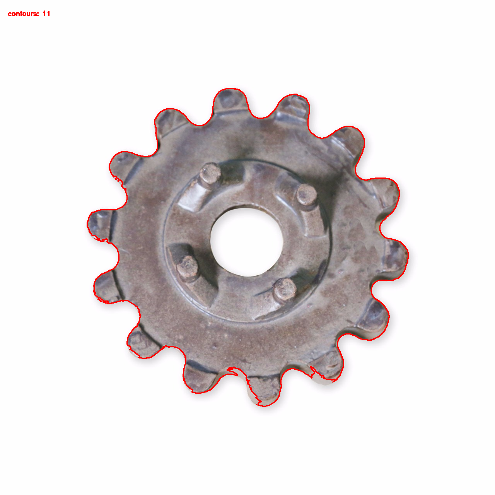
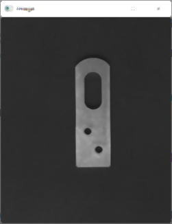
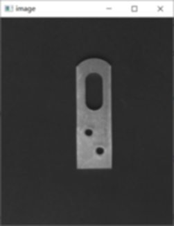
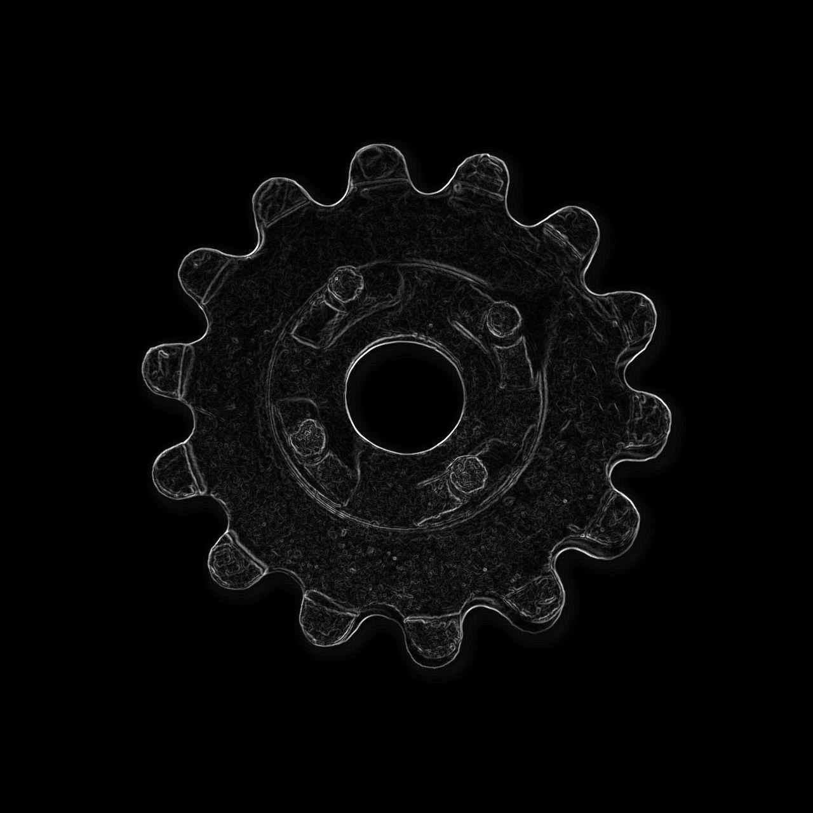
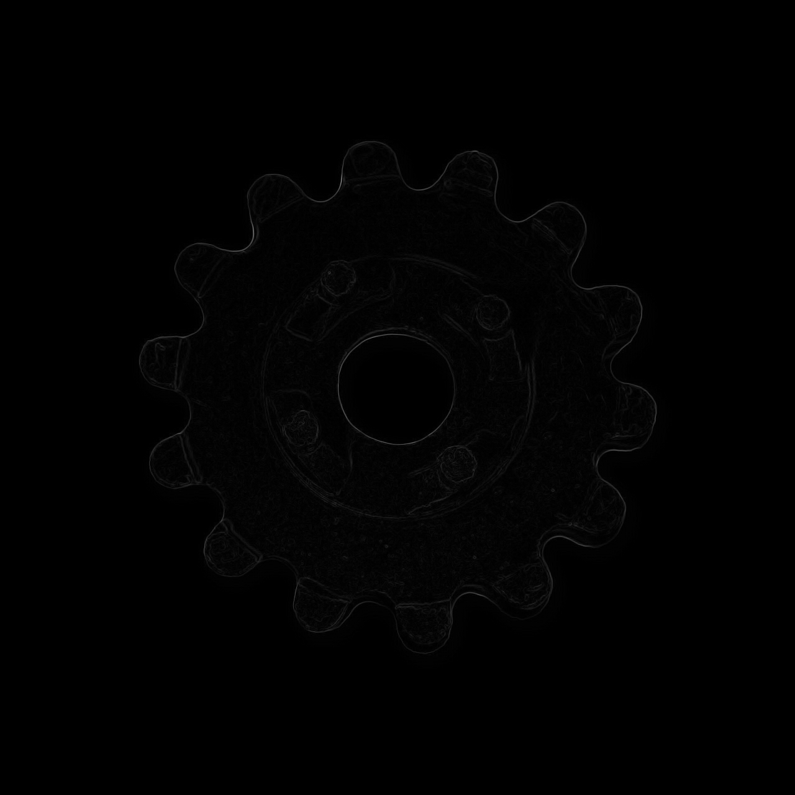

# 实验一过程记录

## 运行环境

- Conda 环境：opencv
- 运行命令：`conda run -n opencv python experiment1.py`
- 主要库：OpenCV、NumPy

## 实验过程

1. 读取 `齿轮.bmp`，转换为灰度图，设置阈值 180 进行二值化，再对二值图反色。
2. 在反色图上使用 `cv2.findContours` 提取目标边界轮廓，并将轮廓绘制到原图。
3. 读取 `20210416144049781.png`，分别执行均值滤波、中值滤波、高斯滤波。
4. 对高斯滤波结果执行 Canny 边缘检测，得到高斯边缘检测结果。
5. 再次读取 `齿轮.bmp`，灰度化并反色，分别使用 Sobel 算子和 Robert 算子进行边缘检测。

## 结果图

## 输出文件

- `results/01_gray.png`：灰度图
- `results/02_threshold.png`：阈值分割图
- `results/03_inverse.png`：反色图
- `results/04_edge_contours.png`：轮廓提取结果
- `results/06_mean_filter.png`：均值滤波结果
- `results/07_median_filter.png`：中值滤波结果
- `results/08_gaussian_filter.png`：高斯滤波结果
- `results/09_gaussian_canny_edge.png`：高斯滤波后 Canny 边缘
- `results/11_sobel_edge.png`：Sobel 边缘检测
- `results/12_robert_edge.png`：Robert 边缘检测
- `results/result_summary.txt`：运行结果摘要

