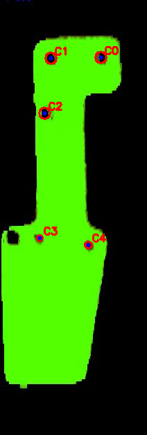
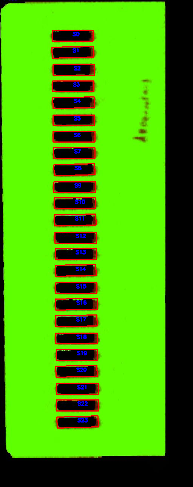
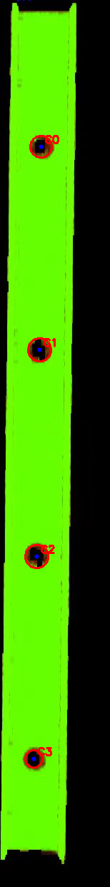

# 实验三 视觉测量及参数计算实验报告

## 一、实验目的

掌握基于单目视觉的目标参数测量方法；实现图片中圆孔、长形孔等形状检测，计算关键点坐标、孔心距离、长度、宽度和面积等参数；分析如何在相同硬件条件下提升测量精度。

## 二、实验设备及仪器

计算机；Python；OpenCV；NumPy。

## 三、图像处理思路总结

本实验围绕“工件区域提取、孔洞轮廓检测、几何参数计算”展开。由于三张工件图中绿色目标与黑色背景、黑色孔洞差异明显，先在 HSV 空间提取绿色工件并填充工件外轮廓，再只在工件内部寻找黑色孔洞，从而排除外部背景干扰。圆孔使用圆度和最小外接圆得到圆心与半径，长形孔使用最小外接矩形得到长、宽、面积和数量。孔心距通过圆心坐标的欧氏距离计算，单位为像素。

## 四、实验方法与步骤

1. 图像预处理：读取工件图像，进行颜色阈值分割、灰度化、二值化和形态学处理，得到目标边缘轮廓。
2. 形状检测：对圆孔使用轮廓圆度判断和最小外接圆获得圆心与半径；对长形孔使用最小外接矩形获得长度和宽度。
3. 参数测量：根据圆心坐标计算孔心距离；根据长形孔外接矩形计算长、宽，根据轮廓面积统计像素面积。

## 五、实验结果

图 1(a) 圆孔检测结果：

图 1(b) 长形孔检测结果：

图 1(c) 圆孔检测结果：

主要参数和结果：

- 图 1(a) `image1.jpg` 检测到 5 个圆孔。
- 图 1(a) 部分孔心距离：C0-C1 为 72.51 px，C0-C2 为 113.85 px，C1-C2 为 79.46 px，C3-C4 为 71.09 px。
- 图 1(b) `image2.jpg` 检测到 24 个长形孔。
- 图 1(b) 典型长形孔参数：S0 长度 108.0 px，宽度 28.0 px，面积 2836.0 px2。
- 图 1(c) `image3.jpg` 检测到 4 个圆孔，上方两个孔心距离为 282.54 px。

## 六、结果分析

绿色工件与黑色背景、黑色孔洞对比明显，先提取并填充工件外轮廓，再在工件内部查找黑色孔洞，可以减少背景干扰。圆孔测量中，最小外接圆可直接给出圆心和半径；长形孔测量中，最小外接矩形能较稳定地给出长和宽。所有测量结果均为像素值，若要得到实际尺寸，需要加入标定板、参考尺寸或相机内外参进行换算。

## 七、思考与练习

提高测量精度可采用相机标定、畸变校正、稳定光照、提高图像分辨率和亚像素边缘定位。提高计算速度可减少无关区域处理，先进行 ROI 裁剪，再做阈值分割和轮廓检测。

