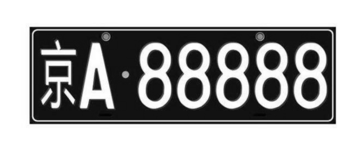
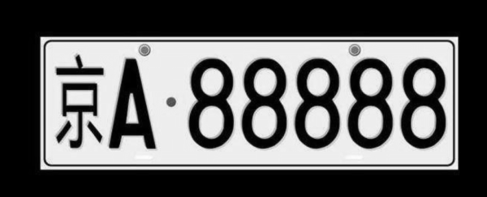
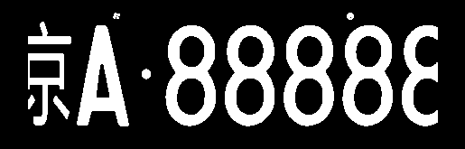
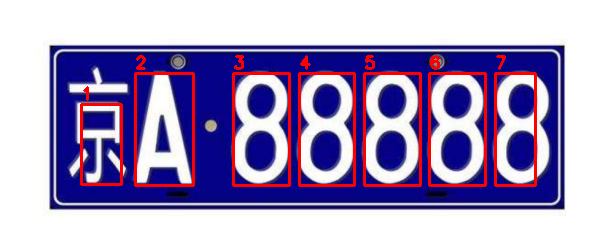
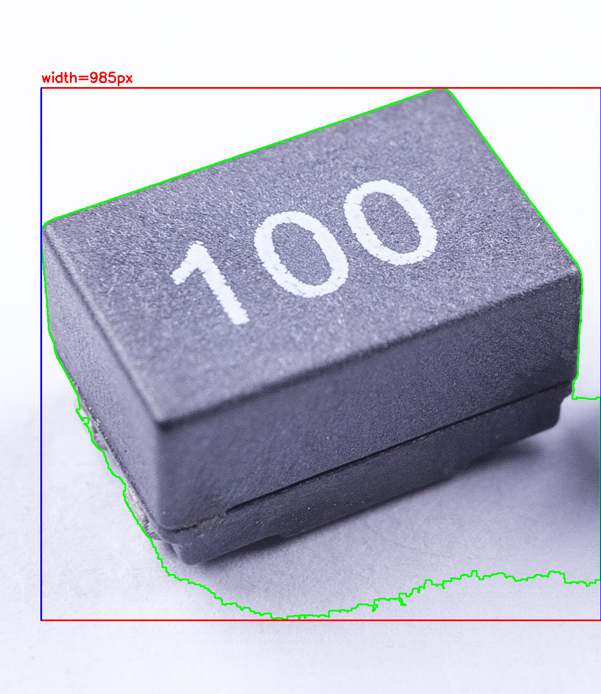
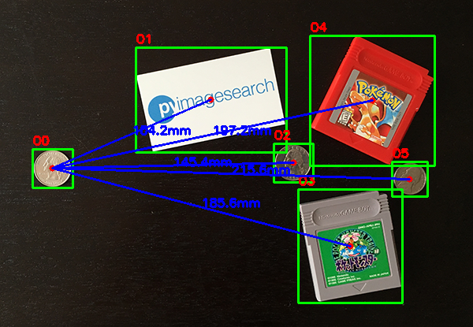

# 实验二 字符分割与距离测量实验报告

## 一、实验目的

掌握单目视觉中的目标分割与测量方法；使用 Python 和 OpenCV 实现车牌字符分割、零件宽度测量和图像中物体之间距离测量。

## 二、实验设备及仪器

计算机；Python；OpenCV；NumPy。

## 三、图像处理思路总结

本实验的核心思路是“先分割目标，再用轮廓几何参数完成测量”。车牌字符分割先定位蓝色车牌区域，减少外部白色背景干扰，再通过灰度反色、阈值分割和轮廓筛选获得字符框。零件宽度测量先截取被测器件区域，再用阈值分割和最大轮廓外接矩形得到宽度像素值。物体距离测量先进行灰度、去噪、Canny、膨胀和腐蚀，随后根据参考物实际宽度建立像素比例，将目标中心点之间的像素距离换算为近似实际距离。

## 四、实验方法与步骤

1. 车牌字符分割：读取 `车牌.png`，灰度转换并反色，定位车牌区域后进行阈值分割，使用轮廓外接矩形获得字符区域。
2. 零件宽度测量：读取 `器件测量.bmp`，截取目标区域，阈值分割后提取轮廓，用矩形框出零件，绘制左右两条直线并计算两线之间的像素距离。
3. 物体距离测量：读取 `物件距离检测.png`，灰度变换并去噪，执行 Canny 边缘检测，再通过膨胀和腐蚀完善轮廓。根据参考对象宽度建立像素比例，计算参考对象与其他物体中心之间的距离。

## 五、实验结果

车牌灰度图：

车牌反色图：

车牌阈值分割图：

车牌字符分割结果：

零件宽度测量结果：

物体距离测量结果：

主要参数和结果：

- 车牌分割得到 7 个字符区域。
- 零件目标区域外接矩形为 `(72, 154, 985, 936)`，测得宽度为 985 px。
- 距离测量中，设定最左侧参考硬币宽度为 24.26 mm，像素比例为 2.1022 px/mm。
- 检测到 6 个目标，参考目标 O0 到其他目标的距离如下：
  - O0 到 O1：219.02 px，104.19 mm
  - O0 到 O2：305.58 px，145.36 mm
  - O0 到 O3：390.14 px，185.58 mm
  - O0 到 O4：414.52 px，197.18 mm
  - O0 到 O5：453.20 px，215.58 mm

## 六、结果分析

车牌图像中字符与背景颜色差异明显，灰度反色和阈值分割后可以较好地提取字符轮廓。零件宽度测量依赖目标区域截取和阈值分割效果，矩形外接框可以直观给出像素宽度。物体距离测量的核心是参考对象标定，像素距离只有通过参考宽度换算后才能得到近似实际距离。

## 七、思考与练习

车牌字符分割中，基于颜色定位车牌 ROI 后再阈值分割效果较好；若直接对整幅图阈值分割，白色背景和边框会干扰字符筛选。测距精度可通过更准确的参考物尺寸、相机标定、透视校正和更稳定的轮廓筛选进一步提升。

